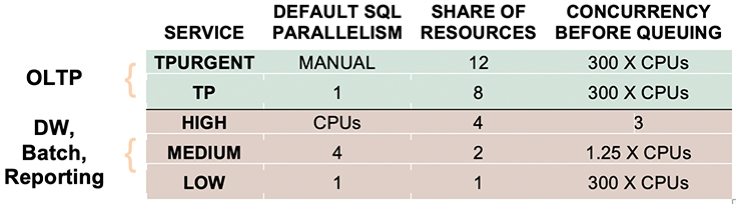

**Note:** This resource can not be created via Oracle Resource Manager due to a issue to create private endpoints

# Autonomous Database - Shared

Oracle Cloud Infrastructure's Autonomous Database is a fully managed, preconfigured database environment with four workload types available, which are: Autonomous Transaction Processing, Autonomous Data Warehouse, Oracle APEX Application Development, and Autonomous JSON Database. You do not need to configure or manage any hardware or install any software. After provisioning, you can scale the number of CPU cores or the storage capacity of the database at any time without impacting availability or performance. Autonomous Database handles creating the database, and the following maintenance tasks:

- Backing up the database
- Patching the database
- Upgrading the database
- Tuning the database

## Workload Types

**DWH**: Built for decision support and data warehouse workloads. Offers fast queries over large volumes of data.

**JSON**: Built for JSON-centric application development. Offers developer-friendly document APIs and native JSON storage.
Autonomous JSON Database is Oracle Autonomous Transaction Processing, but specialized for developing NoSQL-style applications that use JavaScript Object Notation (JSON) documents.

**ATP**: Built for transactional workloads. Offers high concurrency for short-running queries and transactions.

**APEX**: Optimized for application developers, who want a transaction processing database for application development using Oracle APEX, that enables creation and deployment of low-code applications, including databases.

This module enables you to quickly equip your tenancy with a [Oracle Cloud Infrastructure Free Tier](https://docs.oracle.com/en-us/iaas/Content/FreeTier/freetier.htm) instance of a [Autonoumous Data - Shared](https://docs.oracle.com/en-us/iaas/Content/Database/Concepts/adboverview.htm) .

## Prerequistes

1. In case of a ADB with private endpoints, deploy a Landing Zone whose VCN is used to create a private subnet.


## Mandetory Steps

1. Create DB **Compartment**
1. Create Database **User Groups**
1. Create **Policies**
1. Create ADB
    1. Select **VCN**
    2. Enter **Compartment Name**, defaults to ...
    3. Enter **Database Name**, defaults to ....
    4. Select **Workload Type**, defaults to DWH
    5. Enter **Admin Password**
    6. Select **Database Version**, defaults to 19c
    7. Enter **Free Form Tags** 
     

## Optional Steps

1. Select **Private Endpoint** Option
1. Create **private Subnet**
1. Create **Network Security Group**
1. Enter Database **Display Name**, defaults to ...

## Advanced Parameter

1. cpu_core_count
1. are_primary_whitelisted_ips_used
1. is_auto_scaling_enabled
1. is_data_guard_enabled
1. kms_key_id
1. license_model
1. data_safe_status
1. data_storage_size_in_tbs
1. vault_id
1. whitelisted_ips
1. is_free_tier
1. defined_tags 

## Output

1. all_connection_strings
1. connection_urls

## Usage

1. Login to your tenancy
1. Go to Resource Manager
1. Create a stack
1. upload zip files 
1. Plan stack
1. Apply stack

## Connect to a shared Autonomous Database

To connect to a shared Autonomous Database it is required to download a credential zip file from OCI. This database wallet contains the following files:

- cwallet.sso - Oracle auto-login wallet
- ewallet.p12 - PKCS #12 wallet file associated with the auto-login wallet
- sqlnet.ora - SQL*Net profile configuration file that includes the wallet location and TNSNAMES naming method
- tnsnames.ora - SQL*Net configuration file that contains predefined network service names mapped to connect descriptors for the local naming method
- Java Key Store (JKS) files - Key store files for use with JDBC Thin Connections

### Predefined Database Services

A ADB Wallet comes with 5 workload type specific, pre-defined services:




### Download Database Wallet
#### Download DB Wallet File from OCI console:

1. Login to OCI console 
1. Navigate to **Oracle Database** -> **Autonomous Database** -> Database Name
1. Click **DB Connection**
1. Download either an instance or regional wallet 
1. Enter wallet password
1. Store the file to a secure location


#### Download DB Wallet File from Cloud Shell

Determine Autonomous Database OCID from CloudShell:
```bash
john_do@cloudshell:~ (eu-frankfurt-1)$ oci db autonomous-database list --compartment-id ocid1.compartment.oc1..aaaaaaaanh7bdprtzfgw2bb2g2fijhnhgwwmbxxcftyg7jmm6wsbaht7jfda|grep ocid1.autonomousdatabase
      "id": "ocid1.autonomousdatabase.oc1.eu-frankfurt-1.abtheljswzalsmyx4uplo73fv5guyz3wgyeu2r62finaaivuznccm675kcva
```

1. Login to OCI console 
2. Navigate to Oracle Database -> Autonomous Database -> Database Name
3. Start Cloud Shell. Note that Cloud Shell has all necessary tools pre-installed to interact with a database, i.e. Sqlcl, sqlplus, oci cli
 

```bash
export ADBID=<autonomousdatabase OCID>
export WNAME=<Wallet Name, i.e. Wallet_dev.zip>
export WPWD=<Wallet Password>
```
 
4. Execute

```bash 
john_do@cloudshell:~ (eu-frankfurt-1)$ oci db autonomous-database generate-wallet --autonomous-database-id $ADBID --file $WNAME --password $WPWD --generate-type SINGLE
Downloading file  [####################################]  100%
@cloudshell:~ (eu-frankfurt-1)$ ls -l Wallet_dev.zip
-rw-r--r--. 1 john_do oci 20542 May 12 10:13 Wallet_dev.zip

```
Note: User --generate-type ALL for a regional wallet.

### Connect to an ADB Instance

#### Login to an ADB with sqlcl

> [!NOTE]
> sqlcl is preinstalled in Cloud Shell but can be downloaded from https://www.oracle.com/tools/downloads/sqlcl-downloads.html

`sql -cloudconfig wallet_<DB Name>.zip -proxy <webproxy:port> <databaseuser>@<Service Name>`

**Examples**

`sql -cloudconfig wallet_dev.zip  admin@dev_low`
  
`sql -cloudconfig wallet_dev.zip -proxy www-proxy-ams.nl.oracle.com:80 admin@dev_low`

#### Login to an ADB with sqlplus

> [!NOTE]
> Unzip the Wallet file into a directory

`sqlplus -l <databaseuse>r@tcps://<DB Host>:1522/<Service Name>?wallet_location=<directory that contains all Wallet files>& https_proxy=<proxy server>& https_proxy_port`

**Examples**

```bash
sqlplus -l admin@tcps://adb.eu-frankfurt-1.oraclecloud.com:1522/n7dzi8te3ajty_dev_low.adb.oraclecloud.com?wallet_location=./wallet_dev &https_proxy=www-proxy.oracle.com&https_proxy_port=80
```

### Connect with Python

To access to an Autonomous Database instance Python extension module [cx_Oracle](https://pypi.org/project/cx-Oracle/) is required. It can be used with Oracle 11.2, 12c, 18c, 19c and 21c [instance client libraries](https://www.oracle.com/database/technologies/instant-client.html).


```python
import cx_Oracle
import getpass

# Configure sql instance client library and wallet files locations
cx_Oracle.init_oracle_client(lib_dir="<PATH TO INSTANCE CLIENT>\instantclient_19_10",
                             config_dir="<PATH TO Wallet directory>/wallet_DEV")

username = getpass.getpass(prompt='Enter Username? ')
password = getpass.getpass(prompt='Enter %sadmin Password? ' % username)

connection = cx_Oracle.connect(username, password, dsn='dev_low')

cursor = connection.cursor()
rs = cursor.execute("select table_name from all_tables where owner = 'NAO'")
for row in rs:
    print (row[0])

# To insert data into a table:
#cursor.execute("insert into SomeTable values (:1, :2)",(1, "Some string"))
#connection.commit()
```

## Addional Resources


[<][base] | [+][home] | [>][app-infra] 

<!--- Links -->
[home]:       /README.md
[intro]:      /step1-intro/README.md
[provider]:   /step1-provider/README.md
[base]:       /step2-base/README.md
[db-infra]:   /step3-dbinfra/README.md
[app-infra]:  /step4-appinfra/README.md
[workload]:   /step5-workload/README.md
[governance]: /step6-governance/README.md
[vizualize]:  /step7-vizualize/README.md


[code_hello]:       code/tenancy/hello.tf
[code_tenancy]:     code/tenancy/main.tf
[code_provider]:    code/tenancy/provider.tf
[code_tenancy]:     code/tenancy/tenancy.tf
[code_user]:        code/iam/user.tf
[code_compartment]: code/iam/compartment.tf

[oci_certification]: https://www.oracle.com/cloud/iaas/training/architect-associate.html
[oci_cli]:           https://docs.oracle.com/en-us/iaas/tools/oci-cli/latest/oci_cli_docs/
[oci_cloud]:         https://www.oracle.com/cloud/
[oci_cloudshell]:    https://docs.cloud.oracle.com/en-us/iaas/Content/API/Concepts/cloudshellintro.htm
[oci_data]:          https://registry.terraform.io/providers/hashicorp/oci/latest/docs
[oci_sdk]:           https://docs.cloud.oracle.com/en-us/iaas/Content/API/SDKDocs/terraform.htm
[oci_freetier]:      http://signup.oraclecloud.com/
[oci_global]:        https://www.oracle.com/cloud/architecture-and-regions.html
[oci_learn]:         https://learn.oracle.com/ols/user-portal
[oci_learning]:      https://learn.oracle.com/ols/learning-path/become-oci-architect-associate/35644/75658
[oci_homeregion]:    https://docs.cloud.oracle.com/en-us/iaas/Content/Identity/Tasks/managingregions.htm
[oci_identifier]:    https://docs.cloud.oracle.com/en-us/iaas/Content/General/Concepts/regions.htm
[oci_identity]:      https://registry.terraform.io/providers/hashicorp/oci/latest/docs/data-sources/identity_availability_domains
[oci_ilom]:          https://www.oracle.com/servers/technologies/integrated-lights-out-manager.html
[oci_offbox]:        https://blogs.oracle.com/cloud-infrastructure/first-principles-l2-network-virtualization-for-lift-and-shift
[oci_provider]:      https://github.com/terraform-providers/terraform-provider-oci
[oci_region]:        https://registry.terraform.io/providers/hashicorp/oci/latest/docs/data-sources/identity_regions
[oci_regions]:       https://www.oracle.com/cloud/data-regions.html
[oci_regionmap]:     https://www.oracle.com/cloud/architecture-and-regions.html
[oci_sdk]:           https://docs.cloud.oracle.com/en-us/iaas/Content/API/SDKDocs/terraform.htm
[oci_tenancy]:       https://docs.oracle.com/en-us/iaas/Content/GSG/Concepts/settinguptenancy.htm
[oci_training]:      https://www.oracle.com/cloud/iaas/training/


[tf_doc]: https://registry.terraform.io/providers/hashicorp/oci/latest/docs
[cli_doc]: https://docs.cloud.oracle.com/en-us/iaas/tools/oci-cli/latest/oci_cli_docs/
[iam_doc]: https://docs.cloud.oracle.com/en-us/iaas/Content/Identity/Concepts/overview.htm
[network_doc]: https://docs.cloud.oracle.com/en-us/iaas/Content/Network/Concepts/overview.htm
[compute_doc]: https://docs.cloud.oracle.com/en-us/iaas/Content/Compute/Concepts/computeoverview.htm#Overview_of_the_Compute_Service
[storage_doc]: https://docs.cloud.oracle.com/en-us/iaas/Content/Object/Concepts/objectstorageoverview.htm
[database_doc]: https://docs.cloud.oracle.com/en-us/iaas/Content/Database/Concepts/databaseoverview.htm

[iam_video]: https://www.youtube.com/playlist?list=PLKCk3OyNwIzuuA-wq2rVuxUE13rPTvzQZ
[network_video]: https://www.youtube.com/playlist?list=PLKCk3OyNwIzvHm2E-cGrmoMes-VwanT3P
[compute_video]: https://www.youtube.com/playlist?list=PLKCk3OyNwIzsAjIaUaVsKdXcfBOy6LASv
[storage_video]: https://www.youtube.com/playlist?list=PLKCk3OyNwIzu7zNtt_w1dXFOUbAjheMeo
[database_video]: https://www.youtube.com/watch?v=F4-sxIsnbKI&list=PLKCk3OyNwIzsfuB9kj1CTPavjgByJBXGK

[jmespath_site]: https://jmespath.org/tutorial.html
[jq_site]: https://stedolan.github.io/jq/
[jq_play]: https://jqplay.org/
[json_validate]: https://jsonlint.com/

[vsc_site]: https://code.visualstudio.com/

[terraform]: https://www.terraform.io/
[tf_examples]: https://github.com/terraform-providers/terraform-provider-oci/tree/master/examples
[tf_lint]: https://www.hashicorp.com/blog/announcing-the-terraform-visual-studio-code-extension-v2-0-0

[oci_regions]: https://www.oracle.com/cloud/data-regions.html
