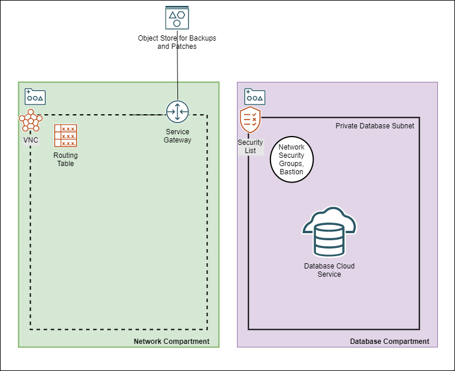
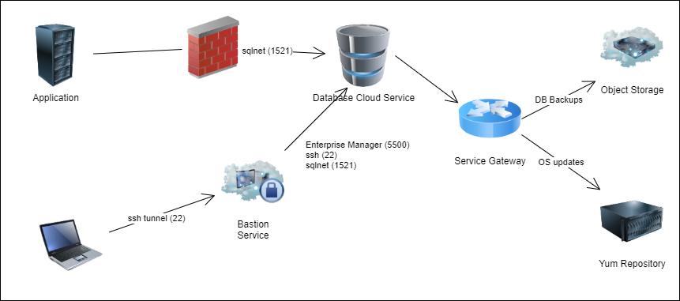

<!-- Copyright (c) 2020 Oracle and/or its affiliates.
Licensed under the Universal Permissive License v 1.0 as shown at https://oss.oracle.com/licenses/upl. -->

[](https://cloud.oracle.com/resourcemanager/stacks/create?zipUrl=https://github.com/oracle-devrel/terraform-oci-ocloud-db/archive/refs/heads/main.zip)

# The OCloud Framework: Database Cloud Service on VM
(Source: [OCI documentation] (https://docs.oracle.com/en-us/iaas/Content/Database/Concepts/overview.htm))

[](https://img.shields.io/badge/license-UPL-green) [](https://sonarcloud.io/dashboard?id=oracle-devrel_terraform-oci-ocloud-db)

Oracle Infrastructure Cloud offers installation of DB system on VM (DBCS) and Exadata (ExaCS) which includes the hardware, storage software, and networking configuration required to run Oracle Databases in the Oracle cloud.

The following use case describes how to provision a DB System on VM through an Oracle Resource Management stack


## Database Cloud Service on VM Stack



Functional Flow:



Oracle Cloud Infrastructure provides single-node DB systems on virtual machines, and 2-node RAC DB systems on virtual machines. If you need to provision a DB system for development or testing purposes, a special fast-provisioning single-node virtual machine system is available.

You can manage these systems by using the Console, the API, the Oracle Cloud Infrastructure CLI, the Database CLI (DBCLI), Enterprise Manager, or SQL Developer.


#### Supported Database Editions and Versions

DBCS supports the following Oracle Database editions:

- Standard Edition
- Enterprise Edition
- Enterprise Edition - High Performance
- Enterprise Edition - Extreme Performance
- Two-node Oracle RAC DB systems require Oracle Enterprise Edition - Extreme Performance.

For standard provisioning of DB systems (using Oracle Automatic Storage Management (ASM) as your storage management software), the supported database versions are:

- Oracle Database 21c
- Oracle Database 19c
- Oracle Database 18c (18.0)
- Oracle Database 12c Release 2 (12.2)
- Oracle Database 12c Release 1 (12.1)
- Oracle Database 11g Release 2 (11.2)

For fast provisioning of single-node virtual machine database systems (using Logical Volume Manager as your storage management software), the supported database versions are:

- Oracle Database 21c
- Oracle Database 19c
- Oracle Database 18c
- Oracle Database 12c Release 2 (12.2)

## Workload Types

Database Cloud Service on VM supports the following Workload Types:

**Dataware House (DW):** Built for decision support and data warehouse workloads. Offers fast queries over large volumes of data.
**Online Transaction Processing (OLTP):** Built for transactional workloads. Offers high concurrency for short-running queries and transactions.


## Prerequistes

The [OCloud Framework] (https://github.com/oracle-devrel/terraform-oci-ocloud-landing-zone) requires that a landing zone is deployed first. The landing zone stack instantiates a VCN, a DB compartment with all policies that allows DB Administrators to provision a DBCS service.

## Default Installation

### Database Sizing

DBaaS on VM ORM Stack includes three standard installation scenarios and a custom mode: 

|  Configuration | Database Version | Oracle Database Software Edition | Shape | OCPUs | Storage(GB) |
|---|---|---|---|---|---|
| Small | 19 | Oracle Enterprise Edition | VM.Standard2.2 | 2 | 512 |
| Medium | 19 | Oracle Enterprise Edition | VM.Standard2.8 | 8 | 4096 |
| Large | 19 | Oracle Enterprise Edition | VM.Standard2.16 | 16 | 8192 |

**Note:** Deployment Type Cluster demands Oracle Enterprise Extreem Performance Edition.

 In order to provision a DBCS stack it is required that a DB compartment was provisioned as part of a landing zone stack whose details are retrieved directly from the remote stack.

In addition to setting the size of the instances to small, medium or large, **Deployment Type** allows you to deploy a fast provisioned instance, a basic instance or a RAC cluster:

| Deployment Type | Storage Management Software | Auto Backup enabled | Node Count |
|---|---|---|---|
| Fast Provisioning | LVM | false | 1 |
| Basic | ASM | true | 1 |
| Cluster | ASM | true | 2 |


**Note:** Note that deployment of a Fast Provisioning instance takes around 20 minutes, a Basic 1 hour and a Cluster 2 hours. 

### Deployment Steps

1. Navigate to OCI Resource Manager
1. Create a Stack
1. Load dbaas.zip
1. Enter mandetory parameters:

|  Parameter |  Default Value |
|---|---|
| Landing Zone Stack ID | Copy and enter the landing zone's OCID |
| Overwrite Organization, Project and Environment? | By default Organization, Project and Environment are pulled from the landing zone stack. |
| DB System Name | User provided non-unique database system name |
| Container Database Name | It must begin with an alphabetic character and can contain a maximum of eight alphanumeric characters. Special characters are not permitted. The unique database name is the DB name plus a random string. Accept the default if you don't have any other preferences |
| User-provided name of Database Home | Accept the default if you don't have any other preferences |
| Pluggable Database Name | The name must begin with an alphabetic character and can contain a maximum of thirty alphanumeric characters. Special characters are not permitted. Pluggable database should not be same as database name |
| DBaaS on VM Standard Configuration | Select Small, Medium or Large configuration |
| Deployment Type | Select Fast Provisioning, Basic, Cluster |
| Public key for SSH access to the DB system | Provide public part of a ssh key |
| Admin Password | Admin password for SYS, SYSTEM, PDB Admin and TDE Wallet |
| Use existing DB subnet? | Deploy the DBCS instance into an existing subnet. This option will skip the creation of a database 
subnet |

**Note:** If the default installation templates for **Configuration** and **Deployment Type** do not fit your needs choose a custom configuration which allow you to fully customize your own DBCS on VM Stack.

**Default Parameter Values**

**Note:** <service label> combines the first characters of the  <organization> with the first 5 characters of the <project> label.

|  Parameter |  Default Value |
|---|---|
| Database Compartment  | [service label]_database_compartment |
| Availability Domain | AD-1 |
| Node Count  | 1 |
| Cluster Name | [service]rac if Node Count = 2 and Cluster Name is not set |
| Oracle Database Software Edition | ORACLE_STANDARD |
| Storage Management Software | ASM |
| License Type | LICENSE_INCLUDED |
| Hostname Prefix | oracledb[project] |
| Fault Domain | FAULT-DOMAIN-1 |
| Timezone | UTC |
| Database Version | 19.0.0.0 (Corresponds to the latest 19c version) |
| Workload Type | OLTP |
| Automatic Backups | Disabled |
| Character Set | AL32UTF8 |
| National Character Set | AL16UTF16 |


## Parameter Reference

| Parameter | Description |
|---|---|
| DB System Name | User provided non-unique database system name |
| Public key for SSH access to the DB system | The public key portion of the key pair to use for SSH access to the DB system. Multiple public keys can be provided. The length of the combined keys cannot exceed 40,000 characters. For information how to generate a ssh key pair refer to [Generate SSH Keys] (https://docs.oracle.com/en/learn/generate_ssh_keys/index.html#use-putty) |
| Admin Password | A strong password for SYS, SYSTEM, PDB Admin and TDE Wallet. The password must be at least nine characters and contain at least two uppercase, two lowercase, two numbers, and two special characters. The special characters must be _, #, or -. |
| Shape Type | Supported values are `VM.Standard2.1`, `VM.Standard2.2`, `VM.Standard2.4`, `VM.Standard2.8`, `VM.Standard2.16` and `VM.Standard2.24` |
| Database Compartment | Compartment where the database resources will be created. |
| Availability Domain | The availability domain where the DB system is located. By default `AD-1` is selected. |
| Node Count | The number of nodes to launch for a 2-node RAC virtual machine DB system. Specify either `1` or `2`. |
| Cluster Name | The cluster name 2-node RAC virtual machine DB systems. The cluster name must begin with an alphabetic character, and may contain hyphens (-). Underscores (_) are not permitted. The cluster name can be no longer than 11 characters and is not case sensitive. If Node Count is 2 and Cluster Name is not given set it defaults to `<service>-rac`. |
| Oracle Database Software Edition | The Oracle Database edition that applies to all the databases on the DB system. Supported values are: <br> - Standard Edition<br> - Enterprise Edition<br> - Enterprise Edition - High Performance<br> - Enterprise Edition - Extreme Performance<br><br>Note: The database edition depends on the database system configuration, i.e. a 2-node RAC deployment demands "Enterprise Edition - Extreme Performance". |
| Storage Management Software | The storage option used in DB system. ASM - Automatic storage management, `LVM` - Logical Volume management. Where `ASM` is default, fast provisioning only can be done with `LVM`. |
| License Type | The Oracle license model that applies to all the databases on the DB system. Options are "Bring Your Own License" (`BYOL`) or "License included" (`LICENSE_INCLUDED`). The default is `LICENSE_INCLUDED`. |
| Network Compartment | By default this DB Stack expects all network related resources (VCN, DRG, IGW, NGW) to exist in a network compartment, `<service label>-network-compartment`.  |
| Database System VCN | Database System VCN, `<service label>_1_vcn`. |
| Database System Subnet | Database System Subnet, `<service label>_db_client_subnet` |
| Database Network Security Group | `<service label>-0-vcn-db-nsg` should allow access to port 1521-1522 from the CIS Landing Zone's application department. |
| Hostname Prefix | The hostname prefix for the DB system nodes. |
| Fault Domain | A Fault Domain is a grouping of hardware and infrastructure within an availability domain. Fault Domains let you distribute your instances so that they are not on the same physical hardware within a single availability domain. A hardware failure or maintenance that affects one Fault Domain does not affect DB systems in other Fault Domains.<br><br>If you do not specify a Fault Domain, Oracle will automatically pick one for you. For a 2-node DBSystem the second node is automatically placed in a different Fault-Domain. |
| Timezone | The time zone to use for the DB system. In Resource Manager you can select from `UTC` or `Europe/Berlin`. Default is `UTC`. |
| CDB Name | The Container Database name must begin with an alphabetic character and can contain a maximum of eight alphanumeric characters. Special characters are not permitted. |
| DB Home Name | The user-provided name of the Database Home. |
| Database Version | A valid Oracle Database version i.e  `19.0.0.0` which Corresponds to the latest 19c version. |
| Pluggable DB Name | The name of the pluggable database. The name must begin with an alphabetic character and can contain a maximum of thirty alphanumeric characters. Special characters are not permitted. Pluggable database should not be same as database name. |
| Workload Type | The database workload type which either can be `OLTP` or `DW`. |
| Automatic Backups | If set to `true`, configures automatic backups. If you previously used RMAN or dbcli to configure backups and then you switch to using the Console or the API for backups, a new backup configuration is created and associated with your database. This means that you can no longer rely on your previously configured unmanaged backups to work. |
| Automatic Backups - Backup Window | Time window selected for initiating automatic backup for the database system. There are twelve available two-hour time windows. If no option is selected, a start time between 12:00 AM to 7:00 AM in the region of the database is automatically chosen. For example, if the user selects `SLOT_TWO` from the enum list, the automatic backup job will start in between 2:00 AM (inclusive) to 4:00 AM (exclusive). Example: `SLOT_TWO` |
| Automatic Backups - Backup Retention Period | Number of days between the current and the earliest point of recoverability covered by automatic backups. This value applies to automatic backups only. After a new automatic backup has been created, Oracle removes old automatic backups that are created before the window. When the value is updated, it is applied to all existing automatic backups. |
| Character Set | The character set for the database. The default is `AL32UTF8` |
| National Character Set | The national character set for the database. The default is `AL16UTF16` |


## Output

1. all_connection_strings

Connection strings to connect to the database's administration service. For Oracle Database 12c and later, they connect to the CDB administration service.

|Format | Output Name | Connection String Example |
| ---  | ---     | --- |
| Easy Connect | cdbDefault | oracledb.db.lndzntst0vcfra.oraclevcn.com:1521/cdb01_fra1nv.db.lndzntst0vcfra.oraclevcn.com |
| Long | cdbIpDefault | (DESCRIPTION=(CONNECT_TIMEOUT=5)(TRANSPORT_CONNECT_TIMEOUT=3)(RETRY_COUNT=3)(ADDRESS_LIST=(LOAD_BALANCE=on)(ADDRESS=(PROTOCOL=TCP)(HOST=10.0.2.161)(PORT=1521)))(CONNECT_DATA=(SERVICE_NAME=cdb01_fra1nv.db.lndzntst0vcfra.oraclevcn.com))) |

**Note:** The stack output does not display the pdb access strings during initial deployment however in the table below you can find examples:

|Format | Output Name | Connection String Example |
| ---  | ---     | --- |
| Easy Connect | pdbDefault | oracledb.db.lndzntst0vcfra.oraclevcn.com:1521/pdb01.db.lndzntst0vcfra.oraclevcn.com |
| Long | pdbIpDefault | (DESCRIPTION=(CONNECT_TIMEOUT=5)(TRANSPORT_CONNECT_TIMEOUT=3)(RETRY_COUNT=3)(ADDRESS_LIST=(LOAD_BALANCE=on)(ADDRESS=(PROTOCOL=TCP)(HOST=10.0.2.161)(PORT=1521)))(CONNECT_DATA=(SERVICE_NAME=pdb01.db.lndzntst0vcfra.oraclevcn.com))) |

## Validate Connectivity to DB and DB nodes

Use `sqlplus`, `sqlcl` or `sqldeveloper` to connect to Container Database or PDB via Bastion Service which was deployed as part of the Landing Zone. All command line utilities are also available via ```Cloud Shell```. Check the output for the appropriate connect string. 

**Bastion Session:**

**Note:** Bastian Service sessions which are created with the initial ORM deployment have a limited time-to-live therefore check the sessions status and recreate them if necessary. 

| Protocol | Session type | IP Address | Port | Maximum session time-to-live (min) | |
|---|---|---|---|---|---|
| ssh | SSH Port Forwarding Session | Host IP | 22 | 10800 | ssh access to database node(s) |
| sqlnet | SSH Port Forwarding Session | Host IP | 1521 | 10800 | sqlplus, sqlcl or sqldeveloper |
| em | SSH Port Forwarding Session | Host IP | 5500 | 10800 | Oracle Enterprise Manager Database Express |

**SSH:**

Once you created an Bastion ssh session, copy the SSH command from the console to create an SSH tunnel from `localhost:localport` to `<database node ip address>:22`.

```
ssh -i <private key file path> -N -L <local port>:<database node ip address>:22 -p 22 <bastion session OCID>@host.bastion.eu-frankfurt-1.oci.oraclecloud.com
```

To ssh to the DB Node use the following command:

```
ssh -i <private key file> opc@localhost -p <local port>
```

**sqldeveloper:**

Once you created an Bastion sql session, copy the SSH command from the console to create an SSH tunnel from `localhost:localport` to `<database node ip address>:1521`.

```
ssh -i <private key file> -N -L <local port>:<database node ip address>:1521 -p 22 <bastion session OCID>@host.bastion.eu-frankfurt-1.oci.oraclecloud.com
```

Open sqldeveloper and create a new database connection:

| Parameter | Value |
|---|---|
| Username | sys |
| Password | admin password |
| Role | SYSDBA |
| Connection Type | Basic |
| Hostname | localhost |
| Port | [local sql port] |
| Service Name | CDB or PDB SERVICE_NAME from DBCS output |

**sqlcl and sqlplus**

Once you created an Bastion sql session, copy the SSH command from the console to create an SSH tunnel from `localhost:localport` to `<database node ip address>:1521`.

```
ssh -i <private key file> -N -L <local port>:<database node ip address>:1521 -p 22 <bastion session OCID>@host.bastion.eu-frankfurt-1.oci.oraclecloud.com
```
Use 

```sql sys@localhost:1523/cdb02_fra1c9.tcedevdb.tceldznnet1.oraclevcn.com AS sysdba```

or

```sqlplus sys@localhost:1523/cdb02_fra1c9.tcedevdb.tceldznnet1.oraclevcn.com AS sysdba```

to login to the database.

**Oracle Enterprise Manager Database Express (19c):**

ssh to database node as user `opc` and open port `5500` in the host firewall.

```
# Allow tcp traffic to port 5555 
sudo iptables -I INPUT -p tcp -m tcp --dport 5500 -j ACCEPT

# Make changes persistent
sudo service iptables save

# Reload firewall rules
sudo service iptables reload

# Validate that port 5500 is enabled
sudo iptables -L -n|grep 5500
ACCEPT     tcp  --  0.0.0.0/0            0.0.0.0/0            tcp dpt:5500

```

Once you created a Bastion em session, copy the SSH command from the console to create an SSH tunnel.

```
ssh -i <private key file> -N -L <local port>:<database node ip address>:5500 -p 22 <bastion session OCID>@host.bastion.eu-frankfurt-1.oci.oraclecloud.com
```

Open a web browser and navigate to `https://localhost:[local port]/em` .

For addition information to connect to other Database versions, check [Monitoring a Database] (https://docs.oracle.com/en-us/iaas/Content/Database/Tasks/monitoringDB.htm)


## Terraform Code

**Database Cloud Service on VM** stack uses a subset of the available parameters of the oci_database_db_system resource nevertheless they respresent all parameters that can be set through OCI console:

```
resource "oci_database_db_system" "dbaas_db_system" {
  availability_domain =             # Target Availability Domain 
  compartment_id      =             # Target Compartment
  database_edition    =             # Data base edition, STANDARD_EDITION, ENTERPRISE_EDITION, ENTERPRISE_EDITION_HIGH_PERFORMANCE and ENTERPRISE_EDITION_EXTREME_PERFORMANCE

  db_home {
    database {
      admin_password =              # DB Admin Password
      db_name        =              # 
      character_set  =              # Character Set
      ncharacter_set =              # 
      db_workload    =              # Workload Type
      pdb_name       =              # PDB Name
      tde_wallet_password =         # Optional TDE Wallet Password

      db_backup_config {
        auto_backup_enabled =       # Enable automated backup to object storage 
        auto_backup_window =        # 2 hour window within 24 hours when the backup is allowed to run, SLOT_ONE, SLOT_TWO, SLOT_THREE, etc
        recovery_window_in_days =   # Number of days between the current and the earliest point of recoverability covered by automatic backups
      }
    }

    db_version   =                 # Database Software version
    display_name =                 # Database System name
  }
  shape           =                # VM shape drives the number of ocpus and amount of memory which is available to the Database System
  subnet_id       =                # Subnet OCID
  ssh_public_keys =                # List of SSH Keys to login the database node(s)
  display_name    =                # Database System name
  hostname                =        # Hostname prefix. OCI will automatically append an node index [1,2]
  data_storage_size_in_gb =        # Database system storage
  license_model           =        # LICENSE_INCLUDED or BRING_YOUR_OWN_LICENSE
  node_count              =        # System node count, 1 or 2.
  cluster_name            =        # Optional cluster name if node_cound is 2
  nsg_ids                 =        # List of DB security OCIDs
  db_system_options {
    storage_management =           # ASM or LVM
    
  }
}
```


## Addional Resources

- [Terraform DB System Resources](https://registry.terraform.io/providers/hashicorp/oci/latest/docs/resources/database_db_system)
- [OCI DB System Documentation](https://docs.oracle.com/en-us/iaas/Content/Database/Concepts/overview.htm)


[<][base] | [+][home] | [>][app-infra] 

<!--- Links -->
[home]:       /README.md
[intro]:      /step1-intro/README.md
[provider]:   /step1-provider/README.md
[base]:       /step2-base/README.md
[db-infra]:   /step3-dbinfra/README.md
[app-infra]:  /step4-appinfra/README.md
[workload]:   /step5-workload/README.md
[governance]: /step6-governance/README.md
[vizualize]:  /step7-vizualize/README.md


[code_hello]:       code/tenancy/hello.tf
[code_tenancy]:     code/tenancy/main.tf
[code_provider]:    code/tenancy/provider.tf
[code_tenancy]:     code/tenancy/tenancy.tf
[code_user]:        code/iam/user.tf
[code_compartment]: code/iam/compartment.tf

[oci_certification]: https://www.oracle.com/cloud/iaas/training/architect-associate.html
[oci_cli]:           https://docs.oracle.com/en-us/iaas/tools/oci-cli/latest/oci_cli_docs/
[oci_cloud]:         https://www.oracle.com/cloud/
[oci_cloudshell]:    https://docs.cloud.oracle.com/en-us/iaas/Content/API/Concepts/cloudshellintro.htm
[oci_data]:          https://registry.terraform.io/providers/hashicorp/oci/latest/docs
[oci_sdk]:           https://docs.cloud.oracle.com/en-us/iaas/Content/API/SDKDocs/terraform.htm
[oci_freetier]:      http://signup.oraclecloud.com/
[oci_global]:        https://www.oracle.com/cloud/architecture-and-regions.html
[oci_learn]:         https://learn.oracle.com/ols/user-portal
[oci_learning]:      https://learn.oracle.com/ols/learning-path/become-oci-architect-associate/35644/75658
[oci_homeregion]:    https://docs.cloud.oracle.com/en-us/iaas/Content/Identity/Tasks/managingregions.htm
[oci_identifier]:    https://docs.cloud.oracle.com/en-us/iaas/Content/General/Concepts/regions.htm
[oci_identity]:      https://registry.terraform.io/providers/hashicorp/oci/latest/docs/data-sources/identity_availability_domains
[oci_ilom]:          https://www.oracle.com/servers/technologies/integrated-lights-out-manager.html
[oci_offbox]:        https://blogs.oracle.com/cloud-infrastructure/first-principles-l2-network-virtualization-for-lift-and-shift
[oci_provider]:      https://github.com/terraform-providers/terraform-provider-oci
[oci_region]:        https://registry.terraform.io/providers/hashicorp/oci/latest/docs/data-sources/identity_regions
[oci_regions]:       https://www.oracle.com/cloud/data-regions.html
[oci_regionmap]:     https://www.oracle.com/cloud/architecture-and-regions.html
[oci_sdk]:           https://docs.cloud.oracle.com/en-us/iaas/Content/API/SDKDocs/terraform.htm
[oci_tenancy]:       https://docs.oracle.com/en-us/iaas/Content/GSG/Concepts/settinguptenancy.htm
[oci_training]:      https://www.oracle.com/cloud/iaas/training/


[tf_doc]: https://registry.terraform.io/providers/hashicorp/oci/latest/docs
[cli_doc]: https://docs.cloud.oracle.com/en-us/iaas/tools/oci-cli/latest/oci_cli_docs/
[iam_doc]: https://docs.cloud.oracle.com/en-us/iaas/Content/Identity/Concepts/overview.htm
[network_doc]: https://docs.cloud.oracle.com/en-us/iaas/Content/Network/Concepts/overview.htm
[compute_doc]: https://docs.cloud.oracle.com/en-us/iaas/Content/Compute/Concepts/computeoverview.htm#Overview_of_the_Compute_Service
[storage_doc]: https://docs.cloud.oracle.com/en-us/iaas/Content/Object/Concepts/objectstorageoverview.htm
[database_doc]: https://docs.cloud.oracle.com/en-us/iaas/Content/Database/Concepts/databaseoverview.htm

[iam_video]: https://www.youtube.com/playlist?list=PLKCk3OyNwIzuuA-wq2rVuxUE13rPTvzQZ
[network_video]: https://www.youtube.com/playlist?list=PLKCk3OyNwIzvHm2E-cGrmoMes-VwanT3P
[compute_video]: https://www.youtube.com/playlist?list=PLKCk3OyNwIzsAjIaUaVsKdXcfBOy6LASv
[storage_video]: https://www.youtube.com/playlist?list=PLKCk3OyNwIzu7zNtt_w1dXFOUbAjheMeo
[database_video]: https://www.youtube.com/watch?v=F4-sxIsnbKI&list=PLKCk3OyNwIzsfuB9kj1CTPavjgByJBXGK

[jmespath_site]: https://jmespath.org/tutorial.html
[jq_site]: https://stedolan.github.io/jq/
[jq_play]: https://jqplay.org/
[json_validate]: https://jsonlint.com/

[vsc_site]: https://code.visualstudio.com/

[terraform]: https://www.terraform.io/
[tf_examples]: https://github.com/terraform-providers/terraform-provider-oci/tree/master/examples
[tf_lint]: https://www.hashicorp.com/blog/announcing-the-terraform-visual-studio-code-extension-v2-0-0

[oci_regions]: https://www.oracle.com/cloud/data-regions.html
